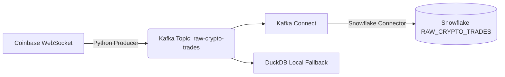

# Crypto Kafka-Snowflake Streaming Pipeline

An end-to-end, production-grade streaming pipeline that ingests real-time cryptocurrency trade data from the Coinbase WebSocket API, buffers and partitions it through Apache Kafka, and sinks the data into Snowflake using Kafka Connect and key-pair authentication.

## Architecture



## Prerequisites
- Docker & Docker Compose
- Python 3.9+
- Snowflake Account (optional, for cloud sync)

## Setup

1. **Create & Activate Virtual Environment:**
   ```bash
   python3 -m venv venv
   source venv/bin/activate
   ```

2. **Install Python Dependencies:**
   ```bash
   pip install -r requirements.txt
   ```

3. **Start Infrastructure:**
   ```bash
   make up
   ```
   *This starts Kafka (KRaft), Kafka Connect (with Snowflake plugin), and Kafka-UI on port 8080.*

4. **Snowflake Configuration:**
   - Execute the SQL scripts in `sql/` starting with `01_setup_snowflake_roles_and_wh.sql`.
   - Generate RSA keys:
     ```bash
     openssl genrsa -out secrets/rsa_key.pem 2048
     openssl rsa -in secrets/rsa_key.pem -pubout -out secrets/rsa_key.pub
     openssl pkcs8 -topk8 -inform PEM -outform PEM -in secrets/rsa_key.pem -out secrets/rsa_key.p8 -nocrypt
     ```
   - Update `config/kafka_connect_snowflake.json` with your Snowflake account details and the one-line version of your `rsa_key.p8`.
   - Apply the public key to your Snowflake user.

5. **Register Kafka Connector:**
   ```bash
   make register-connector
   ```

## Running the Pipeline

1. **Start the Producer:**
   ```bash
   make producer
   ```

2. **Verify in Snowflake:**
   - Check the `RAW_CRYPTO_TRADES` table.
   - Run the views created in `sql/03_analytics_views.sql`.

## Local Testing (No Snowflake)

If you do not have a Snowflake account, you can test the pipeline locally using DuckDB:

1. **Start infrastructure:**
   ```bash
   make up
   ```
2. **Start the producer (Terminal 1):**
   ```bash
   make producer
   ```
3. **Start the local DuckDB consumer (Terminal 2):**
   ```bash
   make consumer
   ```

This creates `crypto_trades.duckdb` and populates real-time trades.

### Querying DuckDB Tables

**Option 1: Built-in Makefile Command (Easiest)**
Run directly in your terminal:
```bash
make query
```

**Option 2: Terminal One-Liner**
```bash
python3 -c "import duckdb; conn = duckdb.connect('crypto_trades.duckdb'); print(conn.execute('SELECT * FROM crypto_trades ORDER BY trade_time DESC LIMIT 10').df())"
```

**Option 3: Interactive Python Shell**
1. Type `python3` in your terminal to open Python mode:
   ```bash
   python3
   ```
2. Paste the Python code into the `>>>` prompt:
   ```python
   import duckdb

   conn = duckdb.connect("crypto_trades.duckdb")
   df = conn.execute("SELECT * FROM crypto_trades ORDER BY trade_time DESC LIMIT 10").df()
   print(df)
   ```

### Stopping Producer & Consumer

To stop the live streams:
- Press **`Ctrl + C`** in the active terminal window.
- Or run the following command from any terminal:
  ```bash
  pkill -f "src/producer|src/consumer"
  ```

## dbt Documentation

To generate and serve the interactive dbt documentation locally (using port 8081 to avoid conflicting with the Kafka UI on 8080):

```bash
dbt docs generate
dbt docs serve --port 8081 --no-browser
```
After running, manually navigate to `http://localhost:8081` in your browser to view the lineage graphs and model details.

## Command Reference

| Command | Description |
| :--- | :--- |
| `make up` | Start Kafka, Kafka Connect, and Kafka UI in Docker |
| `make down` | Stop and remove all Docker containers and volumes |
| `make producer` | Start Coinbase WebSocket producer streaming to Kafka |
| `make consumer` | Start local DuckDB consumer |
| `make query` | Query trade summary and latest 10 trades from DuckDB |
| `make register-connector` | Register Snowflake Kafka Connector |
| `make test-local` | Run unit tests with pytest |
| `make clean` | Remove local DuckDB files and `__pycache__` artifacts |

